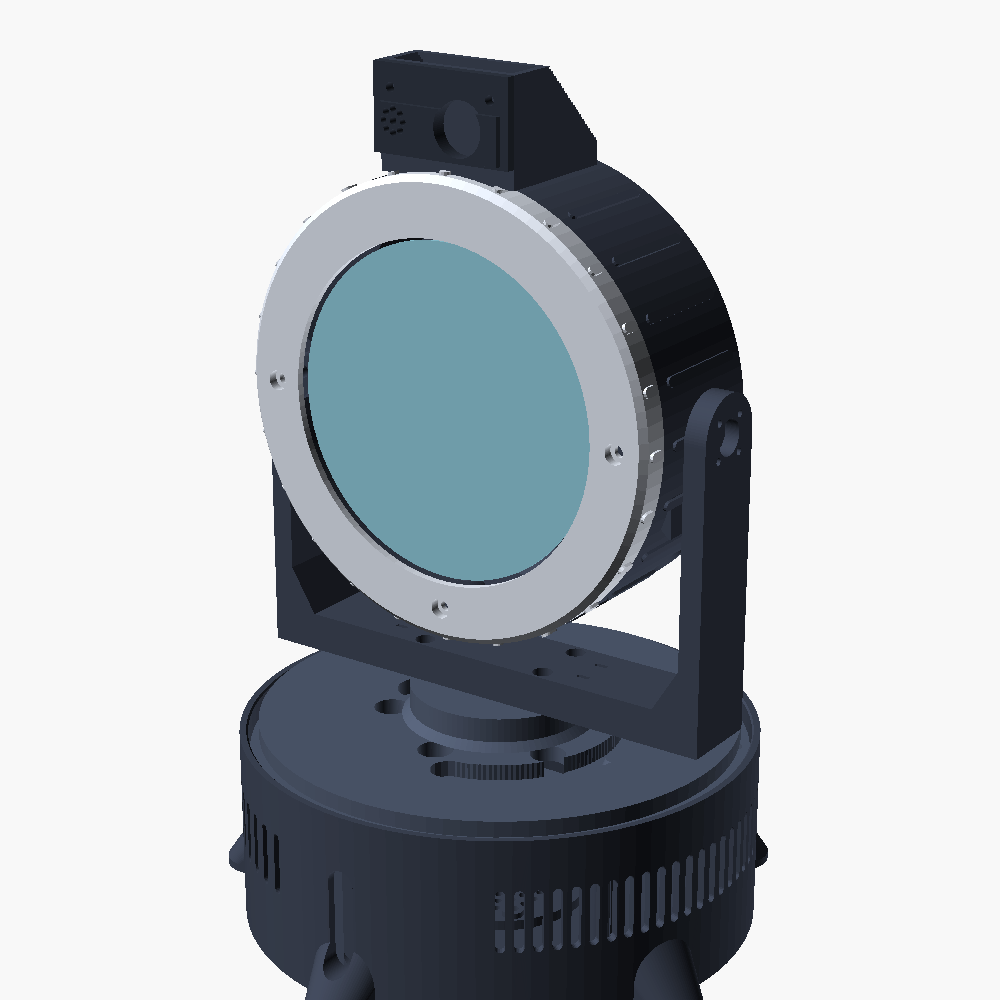
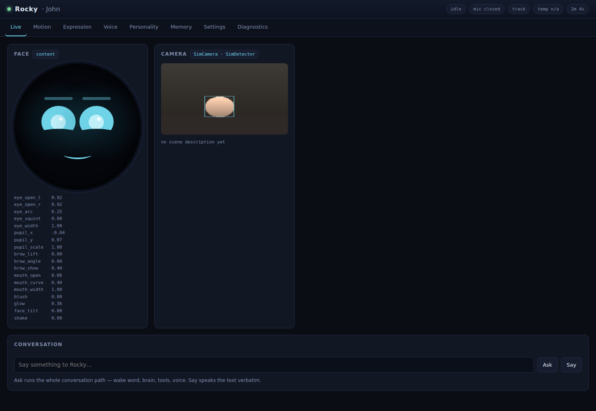

# Rocky

A compact desk companion. A round face that shows what it is thinking, a camera
that watches the room, a head on two motors that turns to look at you, and a
voice with opinions.



Rocky is an alien engineer who lives on your desk. It is blind in the way its
own kind are blind, it thinks in chords rather than words, and it finds most
things about humans genuinely puzzling. Ask it something and it will turn to
face you, think about it visibly, and answer in a sentence or two — usually
after a chord, because a chord is its first language and English is a
translation.

**188 × 184 × 273 mm — about 0.33 cubic feet.**


---

## What it does

- **Watches.** A wide camera finds faces and the head turns to hold you near
  the centre of frame. When nobody is there it looks around now and then, the
  way something alive does.
- **Listens.** Wake word, then speech recognition. Or leave the mic open if
  you work alone.
- **Talks.** A voice pushed away from human, introduced by a musical motif
  chosen to match the expression.
- **Reacts.** Nineteen expressions and twelve gestures, driven by what Rocky
  actually means rather than sprinkled on afterwards. It nods while still
  looking at you.
- **Remembers.** Short facts it chose to keep, in a SQLite file you can open,
  read and delete.
- **Is tunable.** A dashboard for watching everything it does and adjusting
  how it behaves, live.

---

## Try it before you build it

Every hardware backend has a simulated twin, so the whole robot runs on a
laptop with nothing attached. The simulator is closed-loop: there is a subject
at a bearing in a synthetic room, turning the head moves it across the frame,
and face tracking genuinely converges.

```bash
git clone https://github.com/JohnKessler/rocky && cd rocky
python3 -m venv .venv && . .venv/bin/activate
pip install -e .

export ANTHROPIC_API_KEY=sk-ant-...     # optional; without it Rocky moves and
                                        # chirps but does not converse
rocky --sim run
```

Open **http://localhost:8080**. You get Rocky's real face — the browser renders
from the same parameter vector the display does — a simulated camera view with
detections, and every control the robot has.



Type into the conversation box. That text enters the pipeline at exactly the
point a real transcript would, so it exercises the whole path rather than a
shortcut around it.

---

## Building one

| | |
|---|---|
| **[Bill of materials](docs/BOM.md)** | Every part, what the specification actually needs to be, and what is worth spending money on. £330–£420. |
| **[Printing](docs/PRINTING.md)** | Eleven parts, ~780 g, two days of printer time. Settings and orientation per part. |
| **[Wiring](docs/WIRING.md)** | Pin by pin, plus the `config.txt` lines that make the Pi see the hardware. |
| **[Assembly](docs/ASSEMBLY.md)** | Four hours, in an order that works. |
| **[Software](docs/SOFTWARE.md)** | Install, calibrate, tune, and what every setting does. |
| **[Architecture](docs/ARCHITECTURE.md)** | How the code fits together, and why. |

Short version: Raspberry Pi 5 in the head behind a 4″ round display, Camera
Module 3 Wide in a sensor brow above the face, pan and tilt on a PCA9685,
I²S amplifier driving a down-firing speaker in the base, one 12 V input.

The CAD is parametric. Every dimension lives in one file, and the build script
re-renders all eleven parts and checks each mesh is watertight, manifold and in
one piece before you waste filament on it.

```bash
cd hardware/cad && ./build_all.sh
```

---

## Repository

```
docs/            build guides and architecture notes
hardware/
  cad/           OpenSCAD source - rocky_params.scad holds every dimension
  stl/           exported, validated meshes
  wiring/        the wiring as data; generates the diagrams and the tables
  img/           assembly renders and wiring diagrams
  update_docs.py folds both into the guides
  README.md      how the graphics are generated
software/rocky/
  core/          event bus and service lifecycle
  face/          expressions, geometry, renderers
  motion/        kinematics, servos, gestures, tracking
  vision/        camera, detection, the simulated room
  audio/         wake word, speech, synthesis, chirps
  brain/         persona, memory, tools, conversation loop
  web/           dashboard API and front end
tests/           252 tests, all running against the simulated backends
scripts/         installer
systemd/         service unit
```

---

## How it is put together

Six services that never call each other. They publish events and subscribe to
topics, and one module knows they all exist. The consequences are worth the
indirection: a gesture the brain asked for and a gesture you triggered from the
dashboard take exactly the same path, and you can run Rocky without a camera by
editing one file.

Everything that touches hardware ships a real backend and a simulated one and
picks between them at runtime, which is why the test suite can boot the entire
robot.

Three decisions that shaped the rest:

- **The tilt axis runs through the head's centre of mass**, with a trim-weight
  post to get it there. Balanced, the tilt servo fights only inertia — which is
  what lets it be a micro servo, which is what lets the Pi fit beside it, which
  is what keeps the head small enough to balance.
- **The servos de-energise when the head has been still for a moment.** A
  digital servo holding position against its own gear lash hums continuously.
  This one setting is most of the difference between a robot you leave on your
  desk and one you put in a cupboard.
- **The camera lives in a brow above the face, not behind it.** A 24 mm camera
  board will not fit above a 110 mm display inside any sensible head diameter —
  the geometry simply does not close. So Rocky has an eye stalk, which suits it.

---

## A note on Rocky

The character is an affectionate original take in the manner of the Eridian
engineer from Andy Weir's *Project Hail Mary* — an alien who is blind,
tireless, completely without guile, and whose first language is music. The
persona prompt in `software/rocky/brain/persona.py` is written from scratch
rather than quoting the book, and the chords are synthesised rather than
sampled. It is a homage, built for one desk. If you build your own, keep it
that way.

---

## Licence

MIT for the code and the CAD. See [LICENSE](LICENSE).
