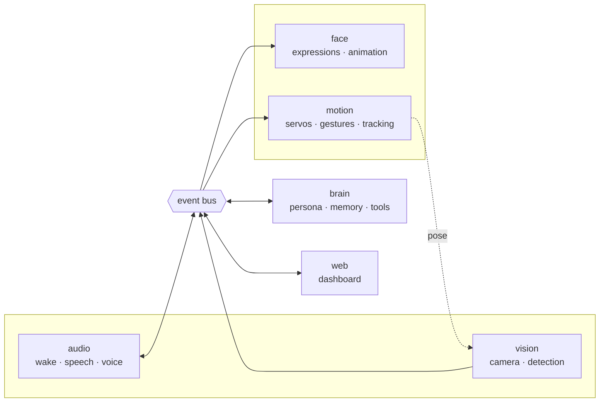

# Architecture

How the code fits together, and the reasoning behind the parts that are not
obvious.

## The shape of it

Six services that never call each other. They publish events onto an in-process
bus and subscribe to topics; one module, `rocky/app.py`, knows they all exist.



The indirection earns its keep three ways:

- A gesture the brain asked for and a gesture you clicked in the dashboard take
  **exactly the same path**, so the dashboard is a real test of the robot rather
  than a parallel implementation of it.
- Running without a camera, or with the face on another machine, is an edit to
  one file.
- Every service can be tested by feeding it events.

The dotted line from motion back to vision is the simulator closing its own
loop; on real hardware the world does that.

## Simulation is not a stub

Every hardware-facing module ships a real backend and a simulated one and picks
at runtime:

| | Real | Simulated |
|---|------|-----------|
| Servos | PCA9685 over I²C | records channel state |
| Camera | picamera2 | renders a room with someone in it |
| Detection | MediaPipe / Haar cascade | reads the simulator's ground truth |
| Display | pygame on the panel | records the parameter vector |
| Audio | PortAudio | room tone in, buffer out, **in real time** |
| Speech in | faster-whisper | a queue you can push text onto |
| Speech out | Piper / espeak-ng | silence of the right duration |

Two of these are worth dwelling on, because the easy version of each would have
made the simulator lie.

**The camera is closed-loop.** The subject sits at a real bearing in a synthetic
room and drifts slowly; where it lands in frame depends on where the head is
pointing, fed back from the motion service. Turn the head and the subject moves
across the frame as it would through a real lens. Face tracking therefore
genuinely converges in simulation, and a change that makes Rocky overshoot or
hunt shows up in a test instead of on your desk. If the subject falls outside
the lens's field of view it is simply not in the picture, which is what makes
the idle scanning behaviour mean anything.

**Simulated playback occupies real time.** Returning instantly would be faster,
but everything downstream of "Rocky is speaking" keys off how long it lasts —
the mouth animation, the gesture timing, and the gate that stops Rocky
transcribing its own voice. None of it would ever be exercised. The suite turns
this off via `hardware.sim_realtime_audio`; the one test that is actually about
speaking timing turns it back on for itself.

## The face is a parameter vector

An expression is a point in an eighteen-dimensional space and everything between
two expressions is a blend, so the face travels rather than cutting. Three
layers stack each frame:

1. the expression, cross-fading toward whatever was last requested
2. involuntary life — blinks, saccades, a slow swell in the glow
3. gaze, so the pupils reach you before the head finishes turning

Layer 2 is what stops the face reading as a picture. A face that holds perfectly
still is unsettling in a way that is hard to name and impossible to miss.

Two renderers consume the same vector: pygame on the panel, and SVG in the
browser. Because both read the same numbers, the dashboard shows Rocky's actual
face. The geometry maths is duplicated — `layout()` in `face/renderer.py` and
`layout()` in `static/js/face.js` — which is a real cost, paid to keep the
websocket carrying eighteen floats instead of a video stream.

Rendering the dashboard in a browser found two bugs in geometry both renderers
shared: the eyelid mask covered the whole lower half of the eye regardless of
the arc parameter, erasing the pupils of every smiling face; and the mouth's
curve sign was inverted, so every smile drew as a frown.

## Motion has exactly one writer

Everything that wants to move the head publishes an event; the motion loop is
the only thing that writes to a servo. That single-writer rule is what stops
tracking, gestures and dashboard jogging fighting each other.

Each tick the commanded angle is:

```
base (tracking, or a look_at, or idle drift)  +  gesture overlay
```

Offsets, not absolute positions, which is why Rocky can nod while still looking
at you.

### The motion profile

`MotionProfile` computes the fastest speed from which it could still brake to a
standstill exactly on target, and never exceeds it. The result is a trapezoid —
ramp up, cruise, ramp down — which is the movement people read as deliberate
rather than servo-ish.

It uses the **discrete-time** braking solution, not `v = sqrt(2·a·d)`. The
continuous form permits a speed that overshoots by up to one integration step,
and overshoot on a head this size reads as a twitch. Solving
`v² + 2·a·dt·v − 2·a·d ≤ 0` accounts for the step. The tests assert zero
overshoot and bounded acceleration *of the commanded position*, which is the
physical claim — the servo is driven by position, not by the profile's internal
velocity variable.

### Tracking

Proportional, with a deadband, and deliberately not a full PID. An integral term
on a servo with backlash walks the head slowly off target; a derivative term on
a jittery detector makes it twitch. Proportional plus a deadband plus the
profile's own acceleration limit produces the unhurried turn that reads as
attention rather than machinery.

### Torque

The servos de-energise after `motion.idle_torque_off_s` at rest. A digital servo
holding position against its own gear lash hums continuously, and this one
setting is most of the difference between a robot you leave out and one you put
away.

## The brain

One manual tool-use loop, not the SDK's tool runner, because each tool call has
to become a bus event the instant it happens — Rocky's face should change while
it is still deciding what to say, and the runner does not expose that seam.

Ten tools, all of which act by publishing events. One is different: `see`
returns the actual camera frame as image content blocks rather than a
description, so the model looks at the picture.

The system prompt and the tool list are byte-identical every turn and are
cached. Situational context — what Rocky can see, what it remembers — goes into
the *user* turn rather than the system prompt, specifically so the cached prefix
survives. A clock in the system prompt would throw the cache away on every
single request.

Everything that costs an API call lives in `brain/`. Vision publishes frames and
detections and says when the room changed; it never calls the model. One place
spends money, one place to look when the bill is wrong.

## Memory

A table of short facts Rocky chose to keep and a rolling transcript, in a SQLite
file you can open with any tool. That is deliberate for something that lives on
your desk and remembers things about you: you should be able to see exactly what
it has and delete any of it, from the dashboard or with `sqlite3`.

Pruning is by uses then age, so something Rocky keeps coming back to survives
even when it is old.

## Configuration

One pydantic tree, live-patchable by dotted path, with bounds on every field.
The dashboard's settings tab is generated from the schema — type, bounds,
choices and help text — so adding a setting in Python gives it the right control
in the browser with the right limits and no edit to the front end.

The bounds are enforced wherever a value enters, which is why a slider cannot
drive a servo past its limits. Behind that, `motion/kinematics.py` clamps
whatever the config says to the envelope the printed parts allow, and behind
*that* the printed stop post and stop pins are physical.

## Where the CAD and the code meet

`hardware/cad/rocky_params.scad` and `software/rocky/` are kept in step by hand
at exactly three points, all of them documented in both places:

- `MECHANICAL_LIMITS` in `motion/kinematics.py` mirrors `pan_range` and
  `tilt_range`
- `vision.h_fov_deg` / `v_fov_deg` must match the fitted lens
- `face.width` / `face.height` must match the panel

Everything else about the chassis is invisible to the software.

## Reading order

If you are picking this up cold:

1. `core/events.py` — the vocabulary everything speaks
2. `core/bus.py` — how it moves
3. `motion/kinematics.py` — pure arithmetic, no hardware, fully tested
4. `face/expressions.py` — the face as numbers
5. `app.py` — the wiring, in one screen
6. `brain/agent.py` — the conversation loop
