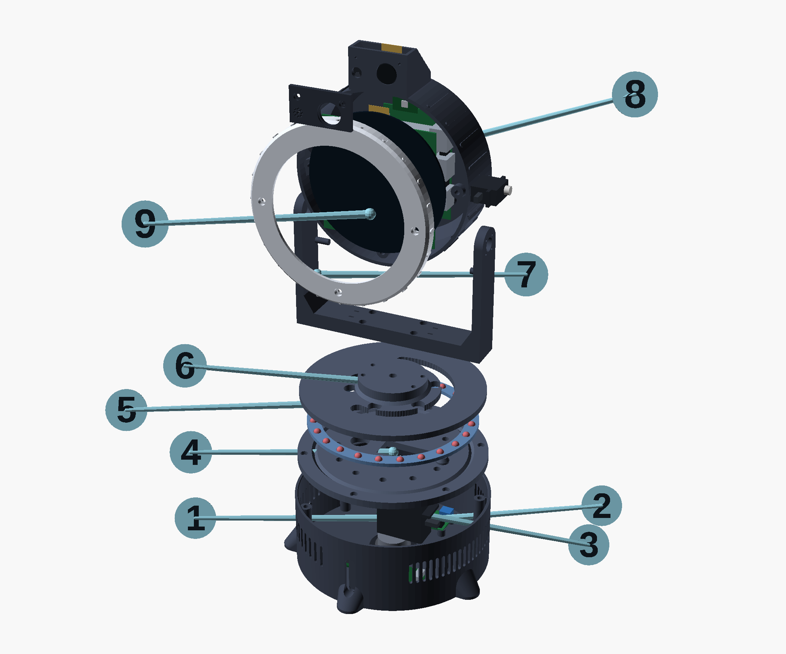
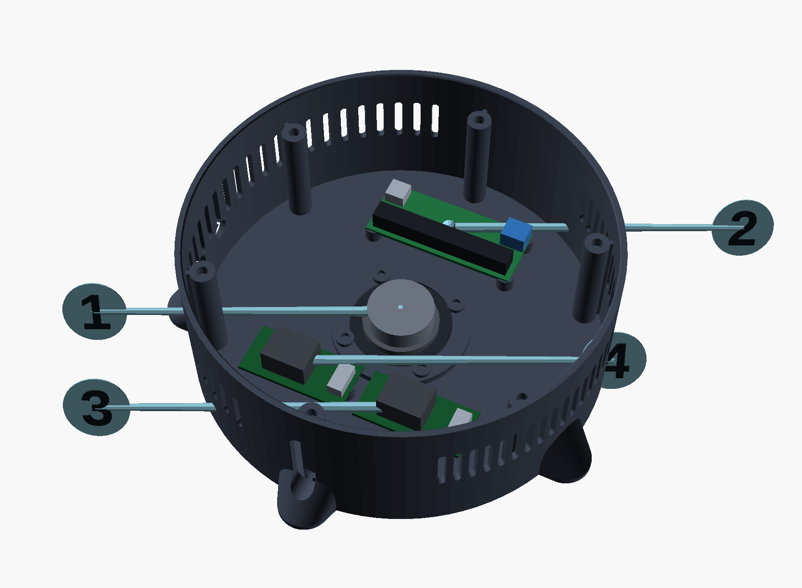
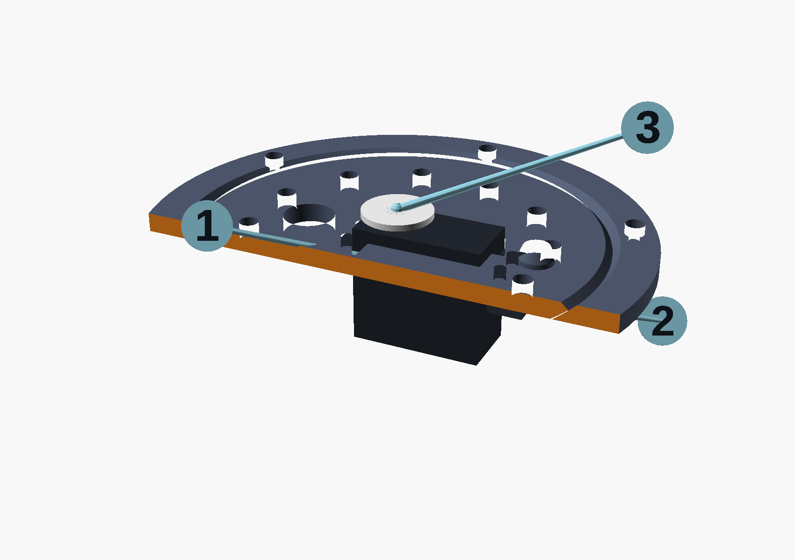
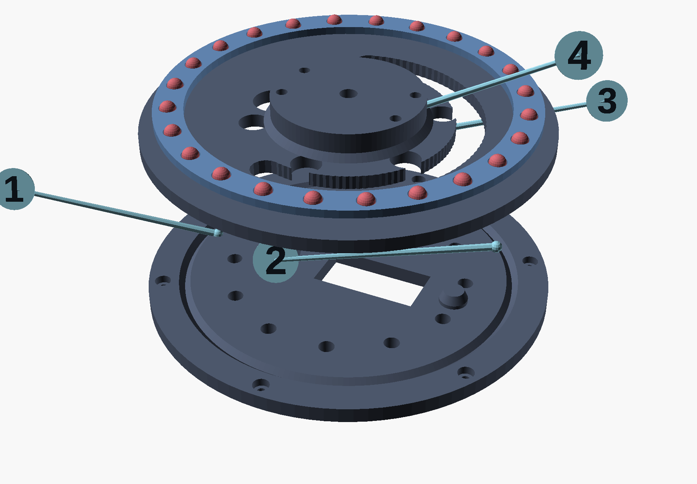
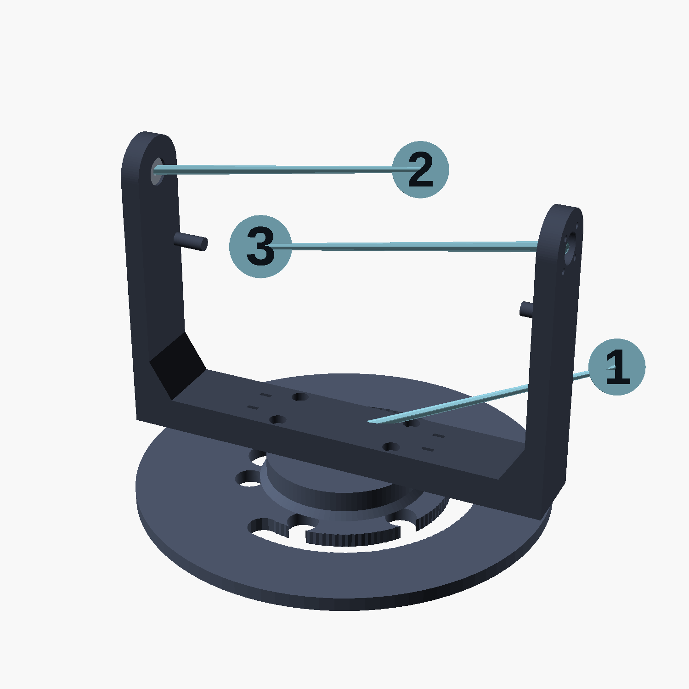
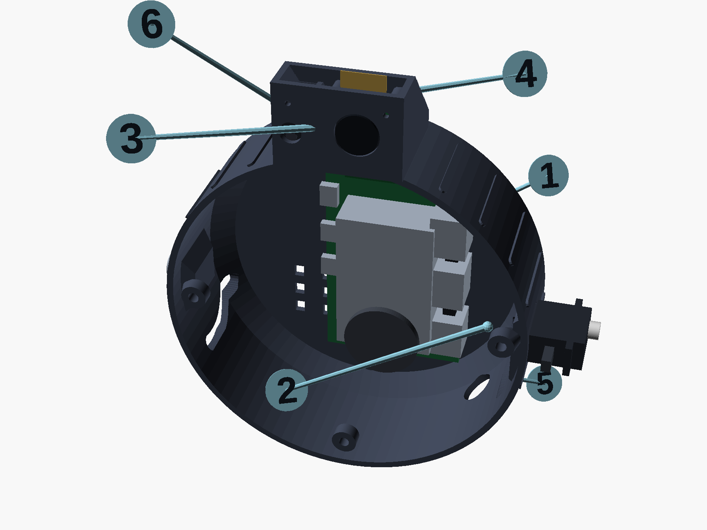
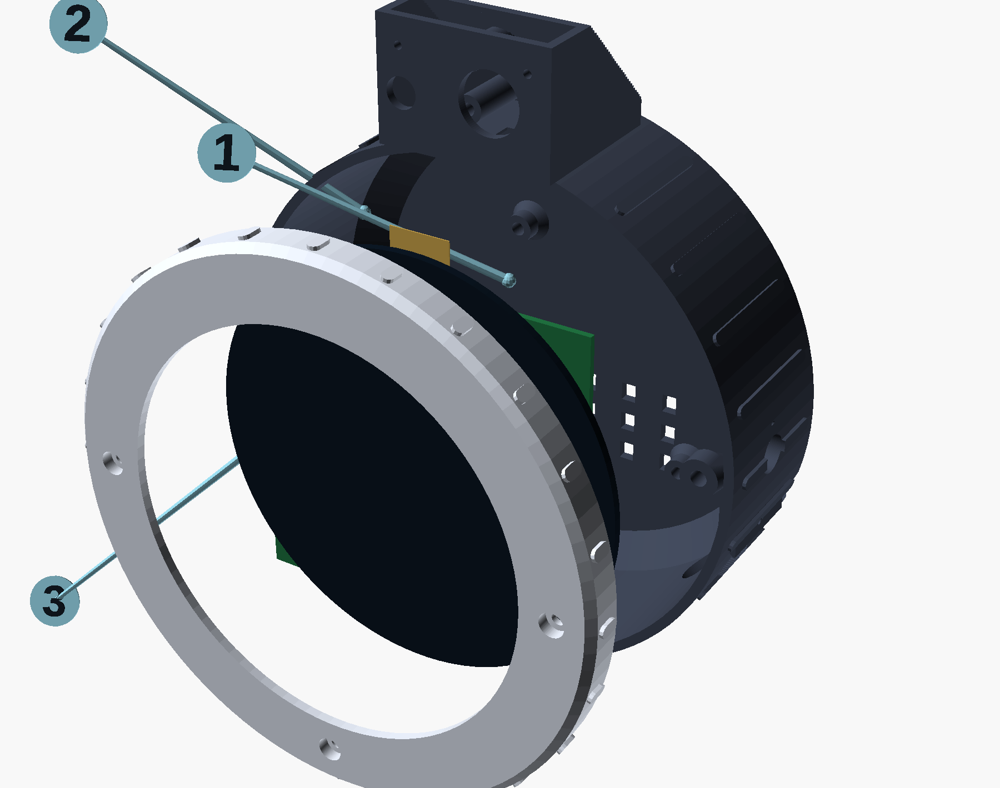
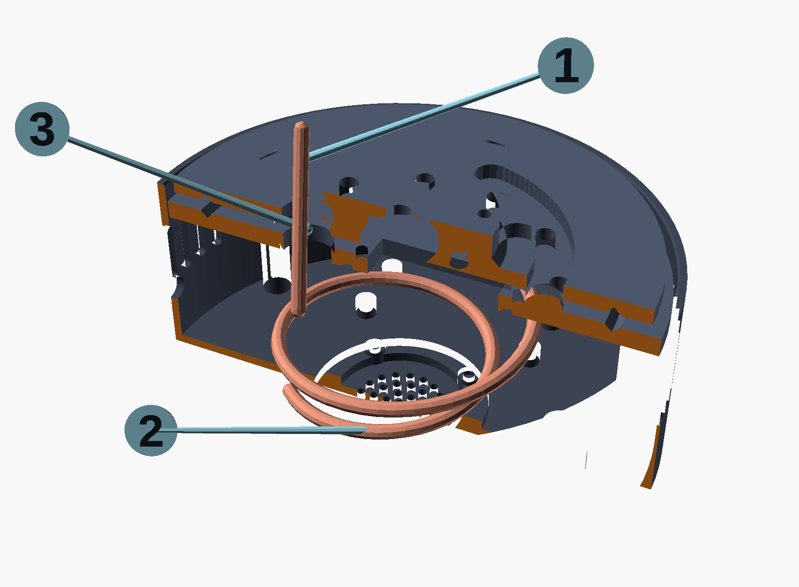
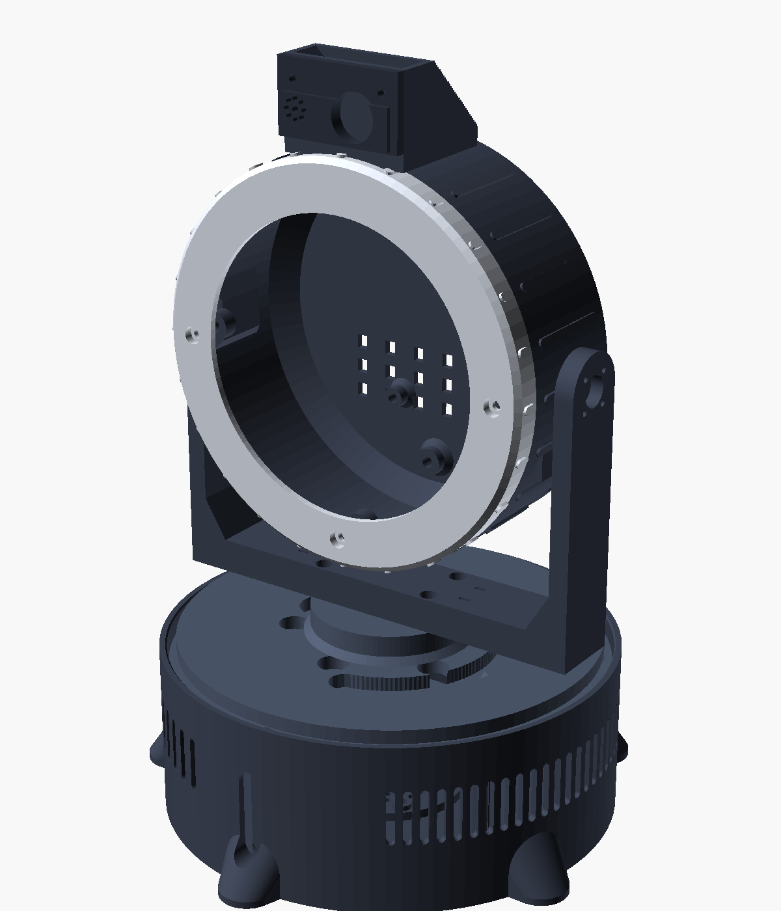

# Assembly

About four hours if the printing and soldering are already done. Work in the
order below — several steps become awkward or impossible if done later.

**Before you start:** get the electronics working on the bench first, following
[WIRING.md](WIRING.md), with `rocky check` reporting real backends. Debugging a
ribbon cable inside a closed head is miserable; debugging one on the desk is
five minutes.

You will need: hex drivers, a small screwdriver, side cutters, a soldering iron
with a heat-set insert tip, calipers, and grease.

**At the bench:** open [bench-guide.html](bench-guide.html) on your phone. It is
this document as one stage at a time, with the figures, the fastener list for
each stage, and steps you can tick off as you go.

<!-- figure:exploded -->


**1.** base_shell  
**2.** base electronics  
**3.** pan servo  
**4.** base_deck (fixed race)  
**5.** ball cage + 24 balls  
**6.** turntable (rotating race)  
**7.** yoke  
**8.** head_back + Pi + tilt servo  
**9.** display + faceplate
<!-- /figure -->

Every figure below is generated from the same CAD as the printed parts, so
what you see is what you will be holding. If you change a dimension, re-run the
chain in [hardware/README.md](../hardware/README.md) and every picture in this
document follows.

---

## Stage 1 — Prepare the printed parts

Do every heat-set insert now, in one session with the iron hot. Going back for
one forgotten insert after wiring means undoing work.

| Part | Inserts | Where |
|------|---------|-------|
| `base_shell` | 6 × M3 | tops of the tall deck bosses |
| `base_shell` | 4 × M2.5 | speaker mounting pads |
| `base_shell` | 4 × M2.5 | PCA9685 pads |
| `base_shell` | 4 × M2.5 | regulator pads |
| `base_deck` | 4 × M2.5 | **underside**, for the pan servo's ears |
| `turntable` | 4 × M3 | hub top, for the yoke |
| `head_back` | 4 × M2.5 | Pi standoffs |
| `head_back` | 3 × M3 | faceplate posts |
| `head_back` | 1 × M3 | right cheek, the tilt pivot |
| `head_back` | 1 × M3 | trim-weight post, rear |
| `head_back` | 2 × M2 | amplifier pads, rear wall |
| `head_back` | 4 × M2 | camera posts inside the brow |
| `head_back` | 2 × M2.5 | brow rim, for the window |
| `head_back` | 2 × M2 | brow, for the mic bracket |
| `faceplate` | 4 × M2.5 | display carrier bosses |

The tilt servo's two ear screws go straight into printed bosses as
self-tappers — no inserts there.

Check every one by hand-threading a screw before moving on.

---

## Stage 2 — The base electronics

<!-- figure:stage2 -->


**1.** speaker, magnet up  
**2.** PCA9685 servo driver  
**3.** 5.1V regulator, feeds the Pi  
**4.** 6.0V regulator, feeds the servos
<!-- /figure -->


Build this as a subassembly, on the bench, before anything goes into the shell.

1. **Speaker.** Lay the TPU gasket on the base floor's raised ring, put the
   speaker on it facing **down** through the grille, and fix it with four M2.5 ×
   10 screws. Snug, not tight — over-tightening distorts the frame and the
   speaker buzzes.
2. **Speaker leads.** Solder a pair of 22 AWG silicone leads to the speaker's
   terminals, long enough to reach up through the pan joint. The amplifier is
   in the head, not down here — see Stage 6 — so these two conductors are part
   of the harness.
3. **Regulators.** Buck A and Buck B onto their pads with M2.5 × 6.
   **Set both output voltages now**, before anything is connected downstream —
   5.1 V and 6.0 V. This is the last comfortable moment to do it.
4. **Servo driver.** PCA9685 onto its pads with M2.5 × 6. Solder the 470 µF
   capacitor across the screw terminal, minding polarity.
5. **Panel parts.** DC jack and switch into the base wall from the inside,
   wired through the fuse holder per [WIRING.md](WIRING.md).
6. **Test.** Power up. Both rails correct, `i2cdetect` finds `0x40`. Do not
   proceed until it does.

---

## Stage 3 — Pan servo and race deck

<!-- figure:stage3 -->


**1.** servo ears bolt UP into the deck  
**2.** body passes through the cutout  
**3.** spline boss, horn goes here
<!-- /figure -->


The pan servo hangs from the deck rather than standing on the floor. It means
the head's weight goes straight through the slew ring into the base wall, and it
removes a bracket.

1. Set the servo to its **centre** before fitting it. Either run
   `rocky calibrate pan` with the servo on the bench, or move it gently by hand
   to the middle of its travel and count turns to each end.
2. Offer the servo up to the deck's **underside**, body passing through the
   rectangular cutout, output shaft up. The ears sit flat against the deck.
3. Four M2.5 × 10 up through the ears into the deck's inserts. Snug.
4. Route the servo lead to channel `0` on the PCA9685.
5. Lower the deck into the base shell so it lands on the six bosses, race groove
   **up**. Six M3 × 12, counterbored from above so the heads sit below the race
   face.

Check: the deck should sit flat and not rock. If it does, one boss printed
proud — sand it rather than forcing the screws.

---

## Stage 4 — The slew ring

<!-- figure:stage4 -->


**1.** grease the V groove, thinly  
**2.** cage sets the ball spacing  
**3.** 24 x 6mm steel balls  
**4.** horn screws up into the hub
<!-- /figure -->


This is the joint Rocky turns on and the one place where a few minutes of care
pays back every time it moves.

1. Wipe both race grooves clean. Any stray strand of filament will be audible
   forever.
2. Put a **thin** film of PTFE or lithium grease in the deck's groove. Thin — a
   thick bead collects dust and drags.
3. Drop the `ball_cage` into the groove so its 24 holes sit over the race.
4. Place one 6 mm ball into each hole. They will sit in the greased V.
5. Fit the **servo horn** to the turntable: a round horn into the recess in the
   hub's underside, four small self-tappers up into the hub.
6. Lower the turntable onto the balls, aligning the horn with the servo's
   spline. Rotate it slowly by hand until the splines engage and it seats.
7. Through the 6.5 mm access hole in the top of the hub, drive the servo's own
   centre screw into the shaft. **This is what stops the head lifting off** —
   there is no other axial retention.
8. Turn the head by hand, both ways. It should be smooth and near-silent, and
   stop firmly against the printed post at about ±100°.

If it grinds, there is too much grease or a ball is out of its pocket. If it
rocks, a ball is missing.

---

## Stage 5 — The yoke

<!-- figure:stage5 -->


**1.** 4 x M3 x 16 into the hub  
**2.** 623ZZ bearing, press fit  
**3.** tilt servo horn fits here
<!-- /figure -->


1. Sit the yoke on the turntable hub, crossbar down, arms up.
2. Four M3 × 16 down through the crossbar's counterbores into the hub's
   inserts. Tighten evenly.
3. Press the **623ZZ bearing** into the pocket on the inside face of the *right*
   arm. It is an interference fit — press it square with a vice or a flat block,
   not a hammer.

Leave the left arm alone for now; the tilt servo horn is fitted at Stage 8.

---

## Stage 6 — The head

<!-- figure:stage6 -->


**1.** Pi 5, portrait, offset right  
**2.** tilt servo, shaft through the cheek  
**3.** camera in the brow  
**4.** microphone  
**5.** trim weights balance the head  
**6.** I2S amplifier
<!-- /figure -->


Everything except the faceplate goes in through the open front.

1. **Tilt servo.** Centre it first, the same way you centred the pan servo.
   Fit it against the pad on the **left** inner cheek, output boss through the
   11 mm hole so the spline protrudes outside the shell. Two M2 × 8
   self-tappers through its ears into the pad. Route its lead down to the
   harness.
2. **Raspberry Pi.** Four M2.5 × 6 onto the four posts rising from the rear
   wall, active cooler already fitted. The board sits portrait, offset to the
   right to clear the tilt servo. Connect the cooler's fan to its header.
3. **Ribbon cables.** Camera cable into `CAM/DISP 0`, display cable into
   `CAM/DISP 1`, blue stiffeners facing away from the board. Leave the far ends
   loose for now.
4. **Camera.** Four M2 × 6 onto the posts inside the brow, lens pointing
   forward. Connect the camera end of its ribbon.
5. **Microphone.** Into the saddle of `mic_mount`, two M2 × 6 into the brow's
   inserts, its port lined up behind the rosette of holes in `pod_window`.
   Route the USB lead down to the Pi — use the right-angle adapter, a straight
   plug fouls the shell.
6. **Amplifier.** Two M2 × 6 onto the pads on the rear wall, above the Pi.
   Wire I²S and 5 V to it from the header per [WIRING.md](WIRING.md), and its
   speaker output down through the harness to the base.

   It sits up here rather than beside the speaker so that two analogue
   conductors cross the rotating joint instead of five digital ones. BCLK
   toggles at about 3 MHz; a flexing harness is not where you want that.
7. **Brow window.** `pod_window` onto the brow's rim, two M2.5 × 8. The lens
   should sit centred in its aperture without touching it.
8. **Power and harness.** Bring the harness in through the 14 mm hole at the
   lower right of the shell. 5.1 V to the Pi's USB-C, I²C and tilt-servo
   conductors down to the base.

---

## Stage 7 — The faceplate

<!-- figure:stage7 -->


**1.** display drops in from behind  
**2.** 4 x M2.5 into the faceplate  
**3.** 3 x M3 through the rim
<!-- /figure -->


1. Lay the faceplate face-down on something soft.
2. Drop the display module into the pocket from behind, glass forward against
   the bezel's lip. It should sit flat with a little clearance all round. If it
   fouls, correct `disp_glass_d` in `rocky_params.scad` and reprint — do not
   file the pocket, it will show through the bezel.
3. Four M2.5 × 6 through the carrier's holes into the faceplate's inserts.
   Gentle: you are clamping glass.
4. Connect the display ribbon.
5. Offer the faceplate to the head, feeding slack ribbon back inside, and fix it
   with three M3 × 16 through the rim into the posts at 3, 9 and 6 o'clock.

The three screw heads are visible on Rocky's face. That is intentional.

---

## Stage 8 — Join the head to the yoke

Two people is easier. One to hold, one to drive screws.

1. Lower the head between the arms so the tilt servo's spline enters the
   **left** arm's recess and the **right** cheek's insert lines up with the
   bearing.
2. **Right side:** M3 × 20 from outside the right arm, through the bearing,
   into the head's insert. Tighten until snug — the bearing's inner race should
   clamp against the head, and the outer race should still turn freely.
3. **Left side:** with the head level and the tilt servo still centred, fit the
   round horn into the arm's recess and drive four M2 × 8 from **outside** the
   arm into the horn.

   Get this right the first time: the horn's splines set where "level" is. If
   the head ends up cocked, pull the four screws, lift the horn off one spline,
   and refit. Small trims are easier in software —
   `motion.tilt.centre_trim_deg`.
4. Tip the head through its full travel by hand. It should move freely and stop
   against the pins at about ±26°, and the crossbar should clear the head's
   lower corners at full tilt.

---

## Stage 9 — Balance the head

**Do not skip this.** The tilt axis is meant to run through the head's centre of
mass. Balanced, the tilt servo only fights inertia and friction, which is what
makes a micro servo sufficient and what stops it humming and drifting. Nose-
heavy, it works against gravity continuously, gets hot, and buzzes.

1. Switch the servos off: `rocky run --sim` in another terminal, or just leave
   the robot unpowered and disconnect the tilt servo lead.
2. Hold the yoke and let the head hang free on its pivot.
3. It will almost certainly tip forward — the display is the heaviest thing in
   there and it is all at the front.
4. Stack M8 washers on an M3 screw into the trim post at the lower rear of the
   head shell. Add until the head sits level on its own and stays wherever you
   put it.
5. Ten washers is typical, around 30 g. If you need more than about twenty,
   something else is wrong — check the Pi is on its posts and not resting
   forward.

---

## Stage 10 — Close up and calibrate

<!-- figure:harness -->


**1.** 11 conductors cross the joint  
**2.** service loop, about 60mm slack  
**3.** 16mm bore at 30mm radius
<!-- /figure -->

1. Dress the harness with the four `cable_clip` pieces. Check the service loop
   coils and uncoils across the full pan range without pulling or snagging.
2. Felt pads under the five legs.
3. Power up.

```bash
rocky check                # every backend should say "ok", not "sim"
rocky calibrate pan        # a/d nudge, s saves
rocky calibrate tilt
```

Calibration writes `centre_trim_deg` into `config.toml`. It is far easier than
getting the horn splines mechanically perfect, and it is what the tool is for.

4. Start Rocky and open the dashboard:

```bash
rocky run
# http://<your-pi>:8080
```

5. On the **Motion** tab, jog both axes to their limits and watch that nothing
   fouls. On the **Expression** tab, click through the faces. On **Voice**,
   play a test tone and a few chords.

That is Rocky finished.

<!-- figure:assembled -->

<!-- /figure -->

---

## If something is wrong

| Symptom | Usually |
|---------|---------|
| An axis moves the wrong way | Set `motion.<axis>.invert = true`. |
| The head sits off-centre | `rocky calibrate`, do not adjust the horn. |
| A servo buzzes constantly at rest | Normal for digital servos. Lower `motion.idle_torque_off_s`. If it persists while driving, the head is out of balance — back to Stage 9. |
| The head drifts down over time | Out of balance, or the tilt horn screws are loose. |
| Rocky turns the wrong way to look at you | `vision.h_fov_deg` does not match your lens. |
| Rocky overshoots then corrects back | `motion.tracking.gain` too high. Try 0.4. |
| Grinding when turning | Grease or a stray ball in the race. Open Stage 4 and look. |
| The face is blank | The display overlay. `dmesg \| grep -i dsi`, and check the ribbon is fully seated. |
| The camera enumerates but returns nothing | Camera ribbon in the display socket, or not fully seated. |
| Rocky answers its own sentences | The microphone is hearing the speaker and `_speaking` gating is not working — check `rocky check` shows a real audio backend. |
| Rocky moves and chirps but never talks | No `ANTHROPIC_API_KEY`, or no speech engine. `rocky check` says which. |
