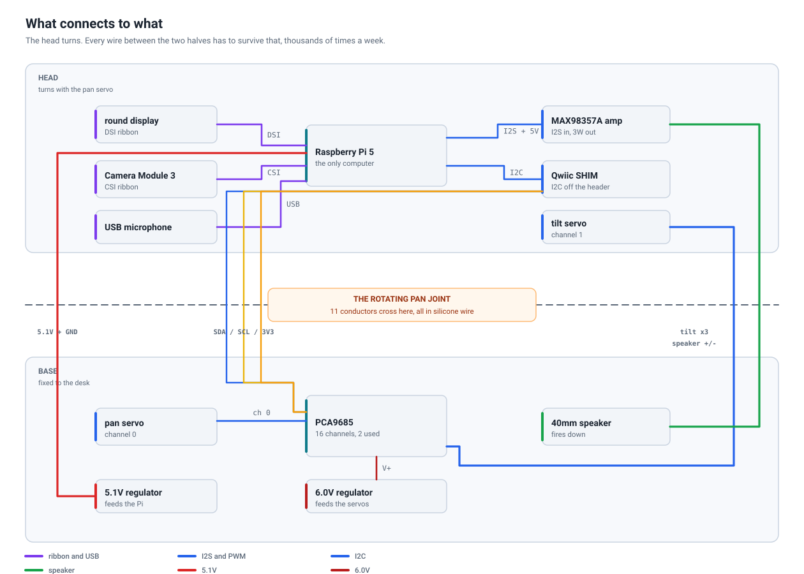
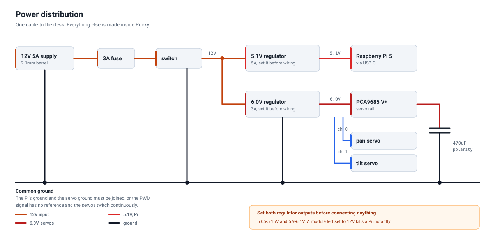
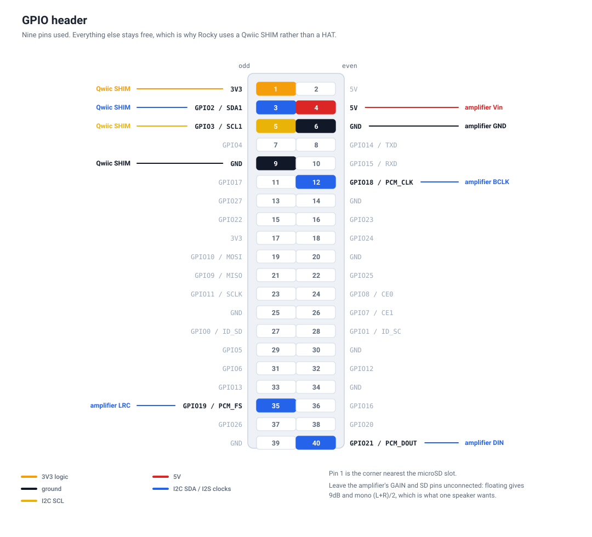

# Wiring

Every connection in Rocky, and the handful of config lines that make the Pi
recognise the hardware.

<!-- wiring:interconnect -->

<!-- /wiring -->

The three diagrams and every table in this document are generated from one
description of the electrics — see [hardware/README.md](../hardware/README.md).

Work through this with the robot **unpowered and unassembled**. Getting the
electronics working on the bench, with `rocky check` reporting everything real,
is far easier than debugging it inside a closed head.

---

## Power

<!-- wiring:power -->

<!-- /wiring -->

One 12 V input feeds two regulators. The Pi and the servos never share a rail,
which is what stops a servo stalling from browning out the Pi mid-sentence.

```
  12V 5A PSU
      │
      ├── [ 3A fuse ] ── [ latching switch ] ──┬── Buck A  5.1V 5A ──► Pi 5 (USB-C)
      │                                        │
      │                                        └── Buck B  6.0V 3A ──► PCA9685 V+
      │                                                                  │
      └── GND ─────────────────────── common ground ────────────────────┘
                                           │
                              470µF across the servo rail
```

**Set both regulators before connecting anything.** Wire the 12 V in, switch on,
and put a meter on each output. Adjustable modules ship at arbitrary settings
and a module set to 12 V will destroy a Pi instantly.

- Buck A must read **5.05–5.15 V**. Not 5.00 — the drop along the USB-C cable at
  4 A is real and the Pi 5 is unusually fussy about it.
- Buck B must read **5.9–6.1 V**. Above 6.2 V will cook a hobby servo.

Ground everything to one point. A star ground at the 12 V jack is easiest.
The Pi's ground and the servo ground **must** be connected or the PWM signal has
no reference and the servos will twitch continuously.

---

## GPIO header

<!-- wiring:gpio -->

<!-- /wiring -->

Nine pins are used: four to the Qwiic SHIM, five to the amplifier. The SHIM
sits over the first few and the rest are wired directly — which is exactly why
the design uses a SHIM rather than a HAT for I²C, since a HAT would cover the
header the amplifier needs.

<!-- tables:gpio -->
| Pin | Signal | Goes to |
|-----|--------|---------|
| 1 | 3V3 | Qwiic SHIM |
| 3 | GPIO2 / SDA1 | Qwiic SHIM |
| 4 | 5V | amplifier Vin |
| 5 | GPIO3 / SCL1 | Qwiic SHIM |
| 6 | GND | amplifier GND |
| 9 | GND | Qwiic SHIM |
| 12 | GPIO18 / PCM_CLK | amplifier BCLK |
| 35 | GPIO19 / PCM_FS | amplifier LRC |
| 40 | GPIO21 / PCM_DOUT | amplifier DIN |
<!-- /tables -->

Leave the amplifier's **GAIN** and **SD** pins unconnected. Floating gives 9 dB
and mono `(L+R)/2`, which is what you want from a single speaker.

### Amplifier to speaker

The amplifier is in the **head**; the speaker is in the **base**. These two
conductors are part of the pan-joint harness.

| MAX98357A | Speaker |
|-----------|---------|
| `+` | red |
| `-` | black |

Not polarity critical with one driver, but stay consistent so a future second
speaker is in phase.

Putting the amplifier in the head is deliberate. With it beside the speaker,
BCLK, LRC, DIN and its supply — five conductors, one of them a 3 MHz clock —
would all have to cross a joint that flexes every time Rocky turns. Analogue
speaker output over the same joint is a far easier life.

---

## I²C

| Device | Address | Notes |
|--------|---------|-------|
| PCA9685 | `0x40` | Default, all address jumpers open. |
| *(display touch controller)* | varies | Present if your panel has touch; harmless. |

Qwiic SHIM → PCA9685, four conductors:

| Qwiic | Colour | PCA9685 |
|-------|--------|---------|
| GND | black | GND |
| 3V3 | red | VCC *(logic — **not** V+)* |
| SDA | blue | SDA |
| SCL | yellow | SCL |

> **VCC and V+ are different pins and confusing them is the classic mistake.**
> VCC is 3.3 V logic from the Pi. V+ is the 6 V servo rail, which goes to the
> green screw terminal. Putting 6 V into VCC pushes 6 V onto the Pi's I²C bus.

### Servo rail

| From | To |
|------|-----|
| Buck B `+` (6 V) | PCA9685 screw terminal `+` |
| Buck B `−` | PCA9685 screw terminal `−` |
| 470 µF `+` | screw terminal `+` |
| 470 µF `−` | screw terminal `−` |

Mind the capacitor's polarity. Backwards, it will vent.

### Servos

| Servo | Channel | Wire colours |
|-------|---------|--------------|
| Pan | `0` | brown/black → GND · red → V+ · orange/yellow → signal |
| Tilt | `1` | same |

These match `motion.pan.channel` and `motion.tilt.channel`.

---

## Ribbon cables

Both are Pi 5 specific: 22-pin 0.5 mm at the Pi end, 15-pin 1 mm at the device.
**They are not interchangeable** — a camera cable in a display socket will not
work and can damage the panel.

| Cable | Pi 5 connector | Other end |
|-------|----------------|-----------|
| Camera | `CAM/DISP 0` | Camera Module 3 |
| Display | `CAM/DISP 1` | Display carrier |

Contacts face the correct way when the blue stiffener is away from the board on
the Pi end. Seat fully, then press the latch down evenly. A ribbon that is
nearly seated produces a display that flickers or a camera that enumerates and
returns nothing — both of which look like software faults and are not.

---

## The pan-joint harness

Eleven conductors cross the rotating joint, between the base and the head:

<!-- tables:harness -->
| Conductor | Gauge | Purpose |
|-----------|-------|---------|
| 5.1V | 20 AWG | Pi supply |
| GND | 20 AWG | Pi supply return |
| GND | 20 AWG | signal ground |
| SDA | 26 AWG | I2C to the servo driver |
| SCL | 26 AWG | I2C to the servo driver |
| 3V3 | 26 AWG | I2C logic level |
| Tilt signal | 26 AWG | PWM to the tilt servo |
| Tilt V+ | 26 AWG | 6V to the tilt servo |
| Tilt GND | 26 AWG | tilt servo return |
| Speaker + | 22 AWG | amplifier output, head to base |
| Speaker - | 22 AWG | amplifier output return |
<!-- /tables -->

**Use silicone-insulated wire.** This bundle flexes every time Rocky turns —
thousands of cycles a week. PVC hookup wire work-hardens and eventually cracks
inside the insulation, which produces an intermittent fault that is genuinely
horrible to find.

Twist the bundle loosely, pass it through the turntable's 16 mm bore at 30 mm
radius, and leave a **generous service loop** — around 60 mm of slack coiled in
the base. Rotate the head fully both ways by hand before closing anything up and
watch that the bundle coils and uncoils rather than pulling taut or snagging.
The printed stop post limits pan to ±100° so the harness can never be wrung, but
it will not save a harness that was too short to begin with.

---

## Every connection

The complete list, generated from the same data as the diagrams above.

<!-- tables:connections -->
| From | To | Carries | Wire | Note |
|------|-----|---------|------|------|
| 12V 5A supply | 3A fuse | 12V | 18 AWG | — |
| 3A fuse | power switch | 12V | 18 AWG | — |
| power switch | 5.1V 5A regulator | 12V | 18 AWG | — |
| power switch | 6.0V 3A regulator | 12V | 18 AWG | — |
| 5.1V 5A regulator | Raspberry Pi 5 | 5.1V to USB-C | 20 AWG | crosses the pan joint |
| 6.0V 3A regulator | PCA9685 servo driver | 6.0V to V+ | 20 AWG | — |
| 6.0V 3A regulator | 470uF capacitor | across V+ | — | — |
| Raspberry Pi 5 | Qwiic SHIM | GPIO2 / SDA | — | — |
| Qwiic SHIM | PCA9685 servo driver | SDA | 26 AWG | crosses the pan joint |
| Qwiic SHIM | PCA9685 servo driver | SCL | 26 AWG | crosses the pan joint |
| Qwiic SHIM | PCA9685 servo driver | 3V3 logic | 26 AWG | crosses the pan joint |
| Raspberry Pi 5 | MAX98357A amplifier | I2S: BCLK, LRC, DIN | 26 AWG | — |
| Raspberry Pi 5 | MAX98357A amplifier | 5V + GND | 26 AWG | — |
| MAX98357A amplifier | 40mm speaker | 4 ohm, 3W | 22 AWG | crosses the pan joint |
| PCA9685 servo driver | pan servo | channel 0 | — | — |
| PCA9685 servo driver | tilt servo | channel 1 | 26 AWG | crosses the pan joint |
| Raspberry Pi 5 | round display | DSI, 22 to 15 pin | — | CAM/DISP 1 |
| Raspberry Pi 5 | Camera Module 3 | CSI, 22 to 15 pin | — | CAM/DISP 0 |
| Raspberry Pi 5 | USB microphone | USB | — | — |
<!-- /tables -->

---

## Pi configuration

Add to `/boot/firmware/config.txt`:

```ini
# --- I2C for the servo driver -------------------------------------------
dtparam=i2c_arm=on
dtparam=i2c_arm_baudrate=400000

# --- I2S audio out ------------------------------------------------------
# Turn off the default (HDMI) audio first, or the I2S device is not created.
dtparam=audio=off
dtoverlay=hifiberry-dac
# Newer kernels have a dedicated overlay; use it instead if present:
#dtoverlay=max98357a,no-sdmode

# --- camera -------------------------------------------------------------
camera_auto_detect=1

# --- display ------------------------------------------------------------
dtoverlay=vc4-kms-v3d
# For the Waveshare 4in round DSI panel. Check their wiki for the exact
# overlay name your panel revision wants - this is the line most likely to
# need adjusting for your hardware.
dtoverlay=vc4-kms-dsi-waveshare-panel,4_0_inch

# --- power --------------------------------------------------------------
# Asserts that the supply really can deliver 5A, so the Pi 5 stops limiting
# USB current and complaining about it. Only set this if your Buck A genuinely
# can - the USB microphone depends on it.
usb_max_current_enable=1
```

Reboot, then check each one:

```bash
i2cdetect -y 1          # expect 40
aplay -l                # expect a card with "sndrpihifiberry" or similar
arecord -l              # expect your USB microphone
rpicam-hello --list-cameras
```

`rocky check` reports all four at once and tells you which backends are real
and which have silently fallen back to simulation.

---

## Before the first power-up

1. Meter both regulator outputs, unloaded. **5.1 V and 6.0 V.**
2. Check continuity between the Pi's ground and the servo ground.
3. Confirm the servo rail is **not** connected to the PCA9685's VCC pin.
4. Check the 470 µF capacitor's polarity.
5. Power up with the servos **unplugged**. Confirm the Pi boots and
   `i2cdetect` finds `0x40`.
6. Plug in one servo. Run `rocky calibrate pan`. It should move smoothly and
   quietly. If it buzzes at rest, that is normal for a digital servo — it is
   exactly what `motion.idle_torque_off_s` exists to stop.
7. Plug in the second servo and repeat with `rocky calibrate tilt`.

If a servo slams to one end and stays there, stop and switch off. It is almost
always a signal wire on the wrong channel or a missing common ground.
